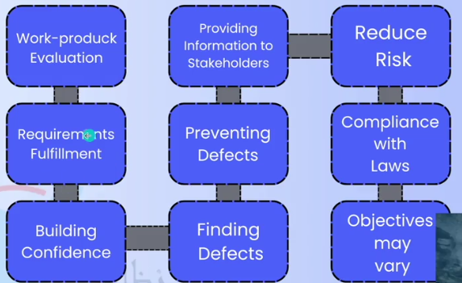
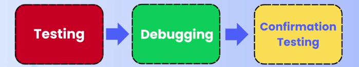
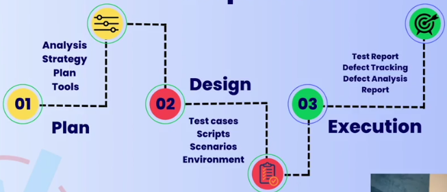
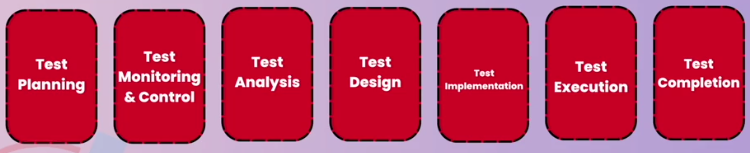
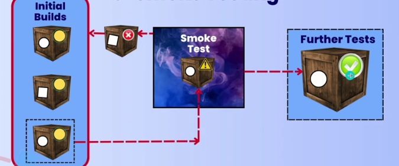

# Basic Concepts of Software Testing

## What is Software Testing ?

Software Testing way to:

1. Assess the quality of the software
2. Reduce the risk of software failure in operation

## Diff. Between Static & Dynamic Testing

1. **Dynamic Testing** : testing app while am using it / provide input & check for output
2. **Static Testing** : reviewing the design / SRS / reviewing the code

## Validation & Verification

* **Verification** : checking all SRS exist or no
* **Validation** : Requirments works or no , valid for user or no , Customer POV

## Objectives of Testing

**Prevent defect** : reviewing the design , follow standars

## Testing & Debugging

**Testing** is done by Software Tester , if defect found , he will report it to developer to debug it 

**Debugging** is about removing the cause of the defect or the cause of the failure.

## Test Process

1. **Test Planning:**
   * Define the scope, objectives, and resources for system testing.
   * Develop a test strategy and identify the required tools and environments.
2. **Test Design:**
   * Create test cases based on requirements and use cases.
   * Design test data and define the expected results.
3. **Test Execution:**
   * Execute test cases and document the results.
   * Report any defects or issues identified during testing.

### Test process Activites ISQTB standard

## Test Levels

1. **Component Test/Unit Test** : focus on components / modules of software
2. **Integration Test** : interaction between components with each other
3. **System Integration** : interaction betweens diff systems like APIs , servers and app
4. **System Testing :** focuses on testing behavior of a whole system , focus on end to end tasks the system can perform , test enviornment should be same of product environment
5. **Acceptance testing** : like system testing with ensuring that system is bug free . Doing acceptance by testing it by Business owner / Clients / Beta users

## Testing Types

1. Functional Testing : Testing what the system does / answered in Yes Or No
2. Non functional Testing : Testing how system performs / measured as a range
3. Black-Box Testing : Testing without knowing the internal structure of the system
4. White-box Testing : Testing while monitoring the internal structure of the system
5. Dynamic Testing : Testing that includes executing the software
6. Static Testing : Testing that doesnot include executing the code / reviewing the system
7. Retesting [Confirmation Testing] : Testing after debugging to ensure defects are fixed
8. Regression testing : Testing unchanged areas to ensure they are not affected by changes
9. Smoke testing : Testing  main functionalities to ensure that the build is stable enough to continue tests

   
